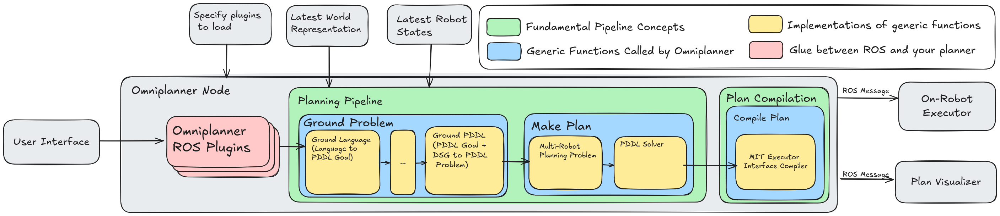

# Omniplanner

Omniplanner provides an interface to solving DSG-grounded planning problems
with a variety of solvers and grounding mechanisms. The goal is to enable
modular design of command grounding and planning implementations, and a clean
hook for transforming the output of a planner into robot-compatible input.

## Motivation

There are many kinds of planning problems we might want a robot to solve. For
example, fully-observed Markovian tasks are well-modeled by PDDL, temporal
constraints may lead us to used LTL or STL, some problems reduce to
special-purpose solvers like a TSP, if there is state or observation
uncertainty we may need to consider POMDP formulations. Each of these problem
types has a large research community surrounding it, and there are many solvers
to choose from. 

It is claimed that these problems are hard, but existing solvers do well enough
on instances that arise in practice. However, when we take a real robot and try
to solve a real user's task, we run into difficulties that are orthogonal to
the hardness considered *within* each of these domains:

*  How do we ground the user's instructions to symbols that the robot has (or
   has not) perceived? 

* How do we decide which kind of problem formulation best captures the desired
  task?

* What is the relationship between the output of a planner and the API call we
  make to get a robot moving? 

* How do we connect the perception system, planner implementation, and
  downstream robot execution into a production-ready pipeline that supports
configuration, logging, and monitoring without obscuring the structure of the
underlying planner?

Omniplanner is a planning system that aims to separate, as generically as
possible, concerns related to problem grounding, problem solving,
robot-specific plan post-processing, and runtime monitoring.

## Architecture

At the highest level, the Omniplanner architecture can be considered in two
halves: The Omniplanner ROS node that provides an interface for combining
planning commands, scene representations, and robot commands, and the
Omniplanner non-ROS code, which defines the generic interfaces that a planner
or language grounding system needs to implement to work with the Omniplanner
node. Integrating a new planner with Omniplanner requires interacting with
almost none of the Omniplanner ROS code. Once you have defined the necessary
planning interface functions (the subject of the next section) for your
planner, all you need to do is create a small interface class the describes how
to turn a ROS message into your planning domain.

This system architecture presents the logical order of the Omniplanner planning
system. This representation is how you should think of Omniplanner, although it
is not a literal representation of the stack trace you will see, due to how the
ROS callbacks are implemented. The Omniplanner ROS plugins subscribe to a ROS
topic. It is up to you to decide how to turn a ROS message into a description
of a planning problem that is solvable by an Omniplanner plugin. The resulting
problem description is then passed through the planning pipeline, which first
grounds the problem and then makes a plan. `ground_problem` and `make_plan` are
two generic functions that you can extend to add functionality. The sequence of
grounding and planning steps (yellow boxes) is decided at *runtime* based on
the type of the original planning request and outputs of the intermediate
grounding/planning functions. After a plan has been found it gets transformed
into a sequence of actions that are aligned with a given robot's interface
(although this last part of the pipeline is somewhat less polished than the
earlier parts).

### Examples

We provide [several examples of the non-ROS
functionality](https://github.com/MIT-SPARK/Omniplanner/blob/feature/docs/omniplanner/examples)
based on Omniplanner's built-in planning options. These examples should run
out-of-the-box, and demonstrate the construction of a planning problem and how
to run the planning pipeline. Running the natural language example may require
providing and setting an API key environment variable.

* (TODO) Omniplanner example roslaunch script and config and scene graph
  publishing
* (TODO) example integrating plugin from external repository

### Omniplanner Planner Dispatch

Implementing a planner plugin requires implementing Omniplanner's
`ground_problem` and `make_plan` interface. At planning time, various planning
and grounding methods can be combined through dispatching on the input and
output types of these modules. You need to implement [an interface like
this](https://github.com/MIT-SPARK/Omniplanner/blob/main/omniplanner/src/omniplanner/goto_points.py)
to give the omniplanner node a hook into your planning and grounding behavior.

Note that you do not necessarily need to implement the full grounding and
planning pipeline for a new plugin. You can leverage existing plugins. For
example, if you want to add a new method for grounding user commands and scene
representations to PDDL, you can implement `ground_problem`, but let an
existing PDDL solver plugin solve the actual problem. 

### Half of what I say is meaningless

Omniplanner's ability to flexibly blend different methods of grounding and
planning depends on dynamic multiple dispatch. Multiple dispatch is a feature
of a programming language that resolves which version of a function to call
depending on the runtime types of its arguments. Note that this is distinct
from overloaded functions in languages like C++, and single (dynamic) dispatch
that you might find in a language like Java (and C++).

With multiple dispatch, you can have a single function (such as
`ground_problem`) with multiple implementations. The implementation to use when
the function is called is determined by the types of the arguments. C++ style
function overloading would require that you know the types at compile time. C++
or Java style polymorphism allows you to define a function whose implementation
depends on the class it is attached to which is resolved at runtime, you are
limited to dynamic dispatch on only a single argument's type, and you are
forced to make ontological commitments about inheritance structure.

Omniplanner uses `plum`, [a multiple dispatch library for
Python](https://github.com/beartype/plum). `plum` implements Julia's multiple
dispatch semantics (including its type coercion system centered around the
`convert` function, although we do not utilize the type coercion here yet).
What this means in practice is that if you decorate your function with
`@dispatch`, then when you call that function the implementation that is used
will be selected based on matching the runtime types of the arguments with the
type annotations in the function's signature.

### Omniplanner ROS plugin

The second thing you need to do is implement the ROS hook. This entails writing
[a class like
this](https://github.com/MIT-SPARK/Omniplanner/blob/main/omniplanner_ros/src/omniplanner_ros/goto_points_ros.py)
with a `get_plan_callback` function. You also need to implement the config
registration at the bottom of the file to enable constructing the plugin based
on the plugin YAML definition.

The planner plugins that Omniplanner loads are defined in a yaml file like
[this one](https://github.com/MIT-SPARK/Awesome-DCIST-T4/blob/main/dcist_launch_system/config/spot_prior_dsg/omniplanner_plugins.yaml). The omniplanner node
takes the path to this [as a rosparam](https://github.com/MIT-SPARK/Awesome-DCIST-T4/blob/main/dcist_launch_system/config/spot_prior_dsg/omniplanner_node.yaml).

## Generic Functors Pattern

While the generic planning pipeline helps us separate concerns over grounding
and planning, and it enables flexible extensions for mixing and matching parts
of the pipeline, it does not automatically address the separation between
operational real-robot concerns (for example, tracking a robot's name or IP
address) and the fundamental planning problem being solved (which probably
doesn't care about the robot's name).

### The Problem
It is likely that the two "ends" of the Omniplanner pipeline -- the ROS plugin
that transforms a goal into a planning problem, and the plan compilation that
turns the output plan into something the robot can execute -- will be robot
specific (or at least specific to the rest of your autonomy pipeline). The plan
compilation step may depend on information that the ROS plugin receives. This
creates a problem: how do we pass new information from the beginning of the
pipeline to the end of the pipeline without needing to change any of
intermediate functions that get called?

### The Functors
The answer is a simple technique, usually associated with functional
programming languages like Haskell, called a `Functor`. Functors sound
complicated, but they are actually pretty simple. In the context of
programming, a functor is a "container" object with a well-defined way of
applying a function that doesn't known anything about your container to the
contents of your container.

Loosely, a class F is a functor if there is a function `fmap` that transforms a
function into a new function that can be applied to an instance of F. Let's
examine the type signature of `fmap`:

`fmap :: (a -> b) -> F a -> F b`

We will consider two ways of parsing this. First, consider `fmap` as a function
that takes in a function that operates on type `a` and returns type `b`. `fmap`
will return a new function that operates on type `F a` and returns type `F b`.
This is the mostly useful way of *thinking* about `fmap`. However, the normal
way that we use `fmap` is as a function that takes two arguments, a function
and an instance of the functor `F a`, and returns `F b`. 

### The Solution
We can get a lot of flexibility in the Omniplanner pipeline by adding a little
bit of extra support for functors. If the problem passed to `make_plan` doesn't
match any other implementation, if the problem is a functor, then it will try
to `fmap` `make_plan` across the problem. This behavior is incredibly powerful,
because it means that we can have an arbitrarily complicated container class
(presumably with a bunch of metadata that we need to carry along with us) that
we pass to the planning pipeline, and the pipeline will solve the problem even
though it doesn't know anything about the structure of this class. The only
requirement is that the creator of this complicated container class defined
`fmap`. 

### Our Implementation

For our pipeline to optionally fmap when it gets a functor as input, we need
our functors to be subclasses of a functor type that we can dispatch on. This
base class is called
[`FunctorTrait`](https://github.com/MIT-SPARK/Omniplanner/blob/3353262d0e8cadab0528a6a1861c3e246076df5e/omniplanner/src/omniplanner/omniplanner.py#L59),
and it does nothing other than enable dispatching. When writing a function type
signature that you want to dispatch on, you use the `Functor` type (instead of
`FunctorTrait`), as `Functor` aggregates the user-defined functors with
built-in iterables. When you define a new functor, you probably need to use our
[`@dispatchable_parametric`
decorator](https://github.com/MIT-SPARK/Omniplanner/blob/3353262d0e8cadab0528a6a1861c3e246076df5e/omniplanner/src/omniplanner/functor.py#L51).
This is necessary for getting Bear-types type inference for dataclasses with
generic type parameters to work as it should, which may be of independent
interest.

An example functor that we use is the
[RobotWrapper](https://github.com/MIT-SPARK/Omniplanner/blob/3353262d0e8cadab0528a6a1861c3e246076df5e/omniplanner/src/omniplanner/omniplanner.py#L59),
which wraps a value with a robot name. The builtin `list` type also gets picked
up and [treated as a
functor](https://github.com/MIT-SPARK/Omniplanner/blob/3353262d0e8cadab0528a6a1861c3e246076df5e/omniplanner/src/omniplanner/functor.py#L65).

## Notes

### Development Note

Currently, there is a final step of importing your custom config into the
Omniplanner Node
[here](https://github.com/MIT-SPARK/Omniplanner/blob/de84ccf5d5f71b6f41b04d9bceb24a11eaeb1fe5/omniplanner_ros/src/omniplanner_ros/omniplanner_node.py#L28),
but the intention is to do automatic plugin discovery. Automatic plugin
discovery will enable all downstream planning plugins to be implemented without
touching the omniplanner node.

### Is Omniplanner right for me?

Omniplanner is inherently experimental in nature, but it seems to work pretty
well for now. We intend to keep the interface reasonably stable, but currently
there are no API stability guarantees. If you use Omniplanner, please let us
know, and we will try slightly harder to not break comptability. 

There are two directional choices to note -- we currently only care about Hydra
3D scene graphs as the world model for kicking off the grounding/planning
process. The *planning* part of omniplanner is pretty generic and is not
tightly integrated with 3D scene graphs, but the ROS subscription to the scene
graph is baked in and some work would be required to genericize the receiving
of alternative world models.

The second directional choice is that we have leaned pretty heavily into
multiple dispatch as the mechanism for combinding planning and grounding
methods. This leads to pretty cool mixing and matching of planning/grounding
methods, but currently it is difficult to statically understand what the
sequence of grounding/planning calls will be for a given problem. It is
probably possible to statically analyze the possible flow of calls to different
planning/grounding functions, but it would require some rather tight
integration with Mypy and probably the Python AST. 

Finally, Omniplanner has been built with reasonably low-rate planning in mind
(on the order of 10 seconds per plan). There is no specific obstacle to
running higher-rate planners, but we currently don't have a very well developed
notion of feedback. Everything happens as a "feed-forward" planning sequence
conditioned on the goal and most recent 3D scene graph. As a result, this system
will work work best out-of-the-box with planners that run at these somewhat
low rates.
